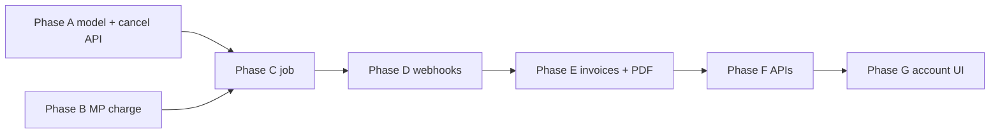

# Billing section, post-trial charges, and invoices — implementation plan

This document extends [`signup-implementation-plan.md`](signup-implementation-plan.md) (especially Phase 3) with concrete scope for **(1)** upgrading the website billing section, **(2)** charging the saved card when the trial ends if the subscription was not cancelled, and **(3)** **invoices** that are **listed, viewable, and downloadable** on `/account`.

---

## Goals

| Goal | Success criteria |
|------|------------------|
| **Billing UI** | Account page has a clear **Facturación / Suscripción** area: plan, trial/paid dates, payment status, cancel-before-trial-ends, link to update card when needed, history entry point. |
| **Post-trial charge** | When `trial_ends_at < now`, company is still trialing, **not cancelled**, and card on file exists → create a Mercado Pago payment; on approval → move company to paid state for the configured period. |
| **Invoices** | Each successful charge (and optionally manual adjustments) produces a **persisted invoice record** with amount, currency, period, taxes as required; PDF or authoritative document **download**; **in-account list + detail/preview** on the website. |

---

## Product decisions (lock before build)

1. **Pricing**  
   Single SKU vs tiers; amount, currency (ARS), IVA/tax treatment. Stored as config/env or `billing_products` table so jobs and invoices use the same numbers.

2. **Billing model**  
   **Recommended first step:** period charge after trial (one payment API call using `mp_customer_id` + `mp_card_id`), then either **manual renewal** or **Mercado Pago subscriptions / preapproval** for recurrence. Confirm against [Mercado Pago Argentina](https://www.mercadopago.com.ar/developers) docs for saved-card charges vs subscriptions.

3. **Cancellation semantics**  
   Define **“cancel before trial ends”**: e.g. user toggles “No renovar” → set `trial_cancelled_at` (or `subscription_intent = cancel_at_trial_end`) → **job must not charge** that company when trial ends. Clarify whether cancelled users lose app access immediately or at `trial_ends_at`.

4. **Invoices vs fiscal compliance (Argentina)**  
   Mercado Pago issues **payment receipts**; **Factura A/B/C (AFIP)** may be a separate obligation. Decide:  
   - **MVP:** invoice row + PDF generated from **your** template + payment metadata (legal text reviewed by accountant); or  
   - integrate a **fiscal invoicing** provider later and treat MP receipt as payment proof only.  
   Document the chosen legal stance in privacy/terms if required.

---

## Current baseline (repository facts)

- Trial signup stores `subscription_plan = 'trial'`, `trial_ends_at`, `mp_customer_id`, `mp_card_id` on `companies` (`CreateTrial` in `repository/company.go`).
- `mercadopago.Client` only implements **SaveCard** (`internal/payments/mercadopago/client.go`) — **no charge API yet**.
- Entitlement for the web is exposed via `GET /auth/me/entitlement`; account UI is `website/src/app/account/AccountPageClient.tsx`.
- No **`trial_cancelled_at`** / **`billing_subscription_status`** columns today — required to implement “charge only if not cancelled.”

---

## Phase A — Data model & cancellation

**Goal:** Represent user intent and charge eligibility in the DB.

**Tasks:**

- [ ] Add migration, e.g.:  
  - `trial_cancelled_at TIMESTAMPTZ NULL` — set when user cancels before trial ends (do **not** charge at trial end).  
  - Optionally `trial_charge_attempted_at`, `trial_charge_last_error` for idempotency and ops (or store in separate `billing_events`).  
  - Paid renewals later: `next_charge_at`, `billing_period`, etc., if not using MP subscriptions exclusively.
- [ ] Extend `Company` model + `GetByIDForBilling` (and any job queries) with new fields.
- [ ] **API:** authenticated endpoint for company owner (or matching role), e.g. `POST /billing/cancel-trial` or `POST /billing/subscription/cancel-at-period-end`, idempotent.
- [ ] **Website:** button + confirmation on account page; copy in Spanish aligned with Terms.

---

## Phase B — Mercado Pago: charge saved card

**Goal:** Server creates a payment using stored customer + card (no raw PAN).

**Tasks:**

- [ ] Implement `ChargeSavedCard` (or equivalent) in `mercadopago.Client` using MP’s documented flow for **customers + stored card** (amount, description, idempotency key `company_id + period` or payment reference).
- [ ] Map MP errors to stable internal codes (card declined, insufficient funds, etc.) for UI and emails.
- [ ] **Secrets:** never log card data; log only MP `payment_id` / status.

---

## Phase C — Post-trial billing job

**Goal:** Automate the first charge when trial expires for eligible companies.

**Tasks:**

- [ ] Selector query: e.g. `subscription_plan = 'trial'` AND `trial_ends_at <= now()` AND `trial_cancelled_at IS NULL` AND `mp_customer_id` / `mp_card_id` present AND **not yet converted** (e.g. no successful charge row — see Phase D).
- [ ] **Idempotency:** same company must not be double-charged if job retries; use DB transaction + unique constraint on `(company_id, charge_type, period_start)` or external idempotency key stored with MP payment id.
- [ ] On **approved** payment (confirm via webhook or synchronous response per MP recommendations):  
  - Set `subscription_plan` to paid tier (`premium`, etc.).  
  - Set `subscription_expires_at` per product rules (or leave null for open-ended if that remains the product rule in `billing.CompanyHasAppDownloadAccess`).  
  - Clear or stop using `trial_ends_at` for entitlement as appropriate.
- [ ] On **failure:** set a `billing_past_due` or status flag; optional grace period; surface on entitlement + account page.

**Infrastructure:** Cloud Scheduler → HTTPS (protected secret) or Cloud Run Job calling the same use-case as tests.

---

## Phase D — Webhooks

**Goal:** Reconcile payments asynchronously; create invoice records when payment is `approved`.

**Tasks:**

- [ ] `POST /webhooks/mercadopago` (or `/payments/notifications`): verify signature / query MP API by `data.id`; idempotent handler.
- [ ] Update company billing state; insert **invoice** row linked to `payment_id`.
- [ ] Retry-safe: duplicate notifications must not duplicate invoices.

---

## Phase E — Invoices persistence & PDF

**Goal:** Durable invoices + files users can open.

**Tasks:**

- [ ] Migration: `billing_invoices` (or `invoices`) with e.g. `company_id`, `amount`, `currency`, `tax_*`, `period_start`, `period_end`, `mp_payment_id`, `status`, `issued_at`, `pdf_storage_key` / `pdf_url`.
- [ ] **PDF generation:** server-side template (HTML → PDF via e.g. chromedp, wkhtmltopdf, or Go PDF lib) stored in **GCS** (you already use GCS for APK — reuse bucket/patterns) or generate on-demand first time then cache.
- [ ] Optional: store MP receipt URL as secondary link if API exposes it.

---

## Phase F — APIs for account page

**Goal:** Backend support for list + download + optional HTML preview.

**Tasks:**

- [ ] `GET /billing/invoices` — paginated list for authenticated user’s company (role check).
- [ ] `GET /billing/invoices/:id` — metadata + presigned URL for PDF or inline `application/pdf` with short TTL.
- [ ] Consider `GET /billing/invoices/:id/preview` returning HTML snippet for “view in browser” without downloading (sanitize; same data as PDF).

---

## Phase G — Website: billing section

**Goal:** Replace/expand “Cuenta y suscripción” with full billing UX.

**Tasks:**

- [ ] Fetch profile (`/auth/me`) + entitlement + **new invoices list** (parallel or single aggregated `GET /account/billing` if you prefer one round-trip).
- [ ] Sections suggested:  
  - **Resumen:** plan name, próximo cobro / fin de prueba, estado (al día / pendiente / cancelado).  
  - **Acciones:** Cancelar antes del fin de prueba (if applicable); “Actualizar medio de pago” (future: MP tokenization flow).  
  - **Facturas:** table (fecha, importe, estado); actions **Ver** (modal/inline) / **Descargar** (opens presigned URL or blob).  
- [ ] Empty states, loading, errors; Spanish copy consistent with legal naming of “comprobante” vs “factura” per your accountant’s guidance.

---

## Phase H — QA, observability, rollout

- [ ] Unit tests: eligibility query, idempotency, webhook deduplication.
- [ ] Integration tests with MP **test** keys; mock HTTP for CI.
- [ ] Metrics/logs: charges attempted, succeeded, failed; webhook processing latency.
- [ ] Staging dry-run: trial company past end → single charge → invoice visible on `/account`.

---

## Dependency order (summary)

Phase G can start with **mock/empty invoices** behind a flag until E/F are ready.

---

## Out of scope (later)

- Email reminders (trial ending, payment failed) — align with signup plan Phase 5.
- Admin back-office for refunds and manual credits.
- Full Mercado Pago **subscription** API if you choose recurring preapprovals instead of periodic job charges.

---

## Document history

- 2026-04-27: Initial plan (billing UI, post-trial charge, invoices on account).
